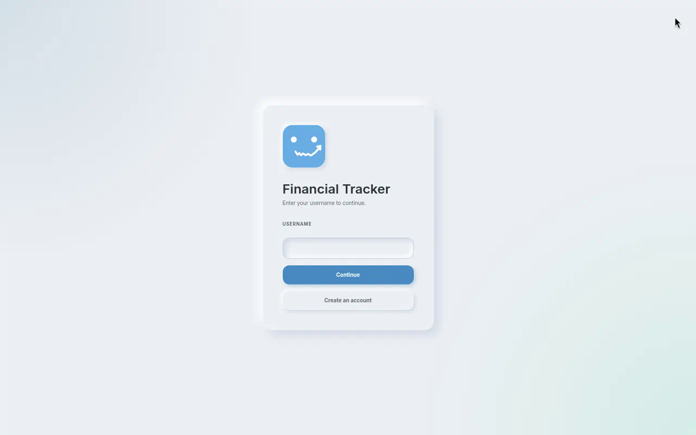
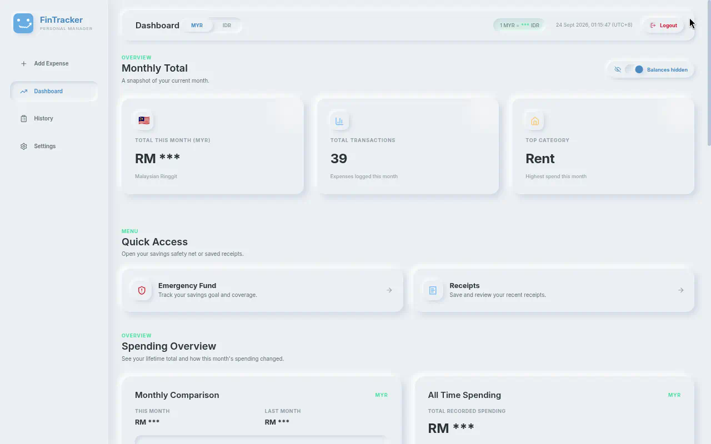
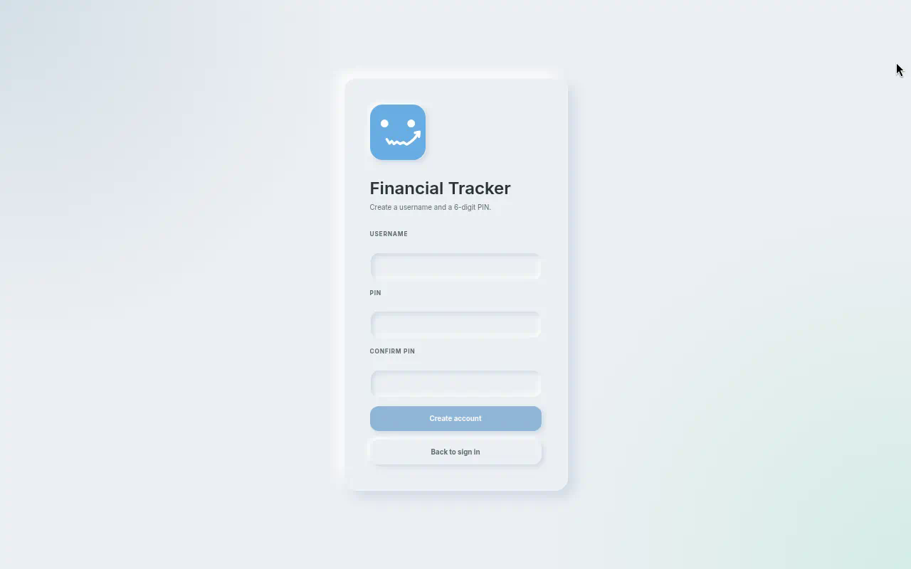
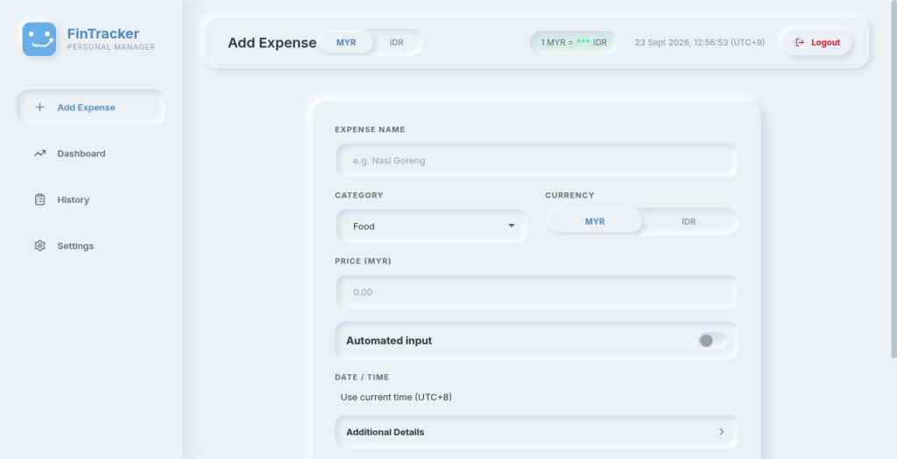
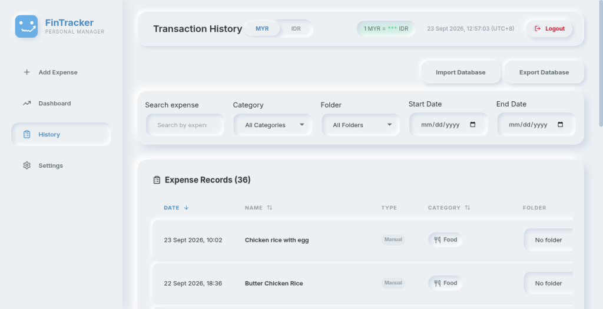
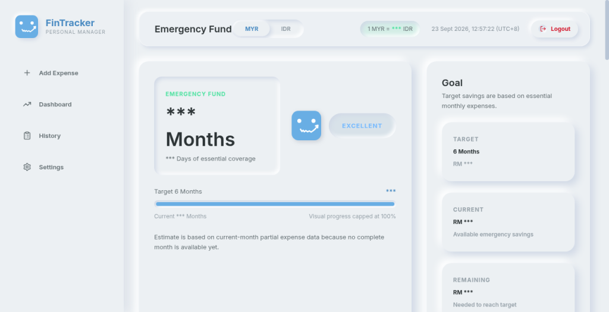
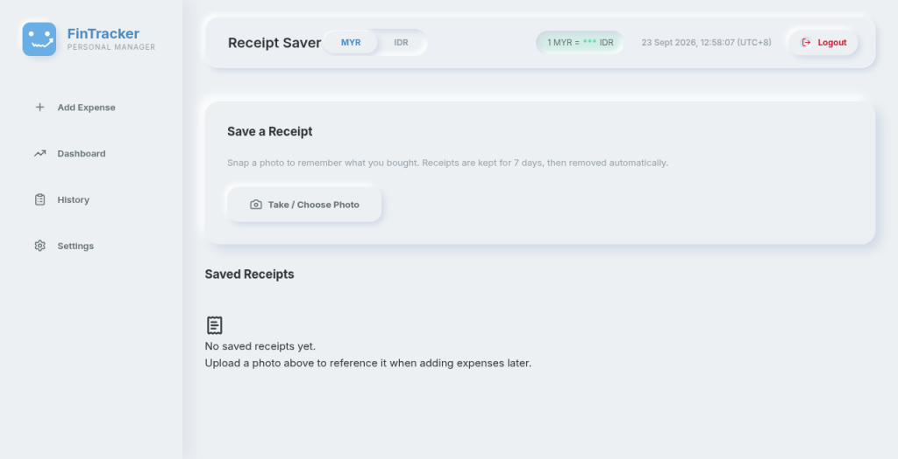
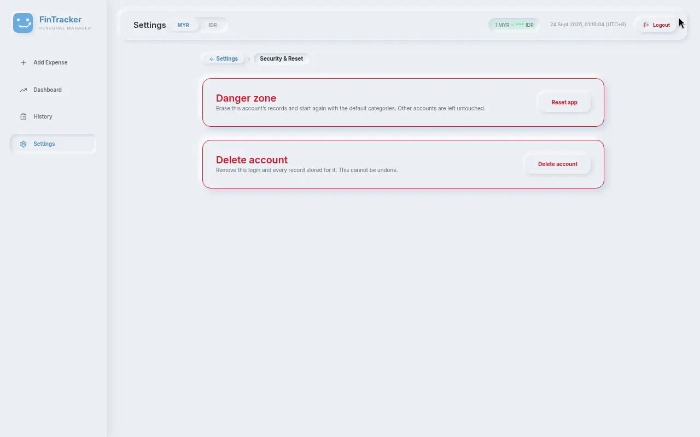

<p align="center">
  
</p>

<h1 align="center">Financial Tracker</h1>

<p align="center">
  <strong>Personal expense manager</strong> with dual-currency MYR ↔ IDR conversion,<br>
  privacy-first balances, analytics, receipts, and an emergency-fund planner.
</p>

<p align="center">
  <a href="https://financial-tracker-pied-delta.vercel.app/"></a>
  
  
  
  
</p>

<p align="center">
  <a href="#overview">Overview</a> ·
  <a href="#features">Features</a> ·
  <a href="#tech-stack">Tech Stack</a> ·
  <a href="#getting-started">Getting Started</a> ·
  <a href="#api-overview">API</a> ·
  <a href="#security">Security</a> ·
  <a href="#license">License</a>
</p>

---

## Overview

Financial Tracker is a full-stack personal finance app built around a **neomorphic (soft UI)** design. It is optimized for people who live across **Malaysia (MYR)** and **Indonesia (IDR)**: every expense stores both currencies using a live exchange rate, with graceful fallback when the rate provider is unavailable.

Accounts are **multi-user**: anyone can register a username + PIN, each account keeps its own records, and deleting an account removes only that account’s server data.

**Live demo:** [financial-tracker-pied-delta.vercel.app](https://financial-tracker-pied-delta.vercel.app/)

> UI images below use **privacy masking** (`***`). Real balances are never required to evaluate the product.

### Login

Sign in with username and a 6-digit PIN, or open **Create an account** to register.

<p align="center">
  
</p>

### Dashboard

<p align="center">
  
</p>

## Features

- **Neomorphic UI** — soft extruded surfaces, inset inputs, pressed toggles, light/dark appearance
- **Dual currency (MYR ↔ IDR)** — log in either currency; server stores both using a cached exchange rate
- **Privacy masking** — hide balances by default or on demand (`***`), including login preference
- **Dashboard analytics** — monthly totals, top category, trends, weekday patterns, insights, MYR/IDR chart toggle
- **Timezone** — timestamps displayed in **UTC+8**
- **Multi-user accounts** — self-serve registration, isolated data per account, and self-service account deletion
- **Auth** — username + PIN session cookies, rate-limited login

### Accounts & registration

Create a personal login from the sign-in screen. Each account’s expenses, receipts, categories, folders, recurring payments, emergency fund, and backup preferences stay isolated from other users.

<p align="center">
  
</p>

### Add expense

Log transactions in MYR or IDR with category, optional custom timestamp, and automatic counterpart conversion.

<p align="center">
  
</p>

### History

Searchable transaction list with category and date filters, sorting, edit, and soft-delete / recycle bin.

<p align="center">
  
</p>

### Emergency fund

Savings target, essential categories, coverage timeline, and what-if planning for your safety net.

<p align="center">
  
</p>

### Receipts

Upload and keep receipt images (JPEG, PNG, WebP, HEIC/HEIF) with server-side signature checks.

<p align="center">
  
</p>

### Settings & backup

Categories, folders, recurring payments, appearance, privacy preferences, XLSX export/import, account reset, and **delete account**.

<p align="center">
  
</p>

Also included:

- **Expense folders** — group related transactions and manage folders from Settings or History
- **Custom FX rate** — override the live rate when you need a fixed conversion
- **Recurring expenses** — scheduled payments with active / paused / cancelled status
- **Backup** — XLSX export/import with spreadsheet formula escaping
- **Account reset vs delete** — wipe this account’s data and keep the login, or permanently remove the account and its server records (other accounts are untouched)

## Tech Stack

| Layer | Stack |
|---|---|
| Frontend | React 19, Vite, TypeScript, Chart.js (`react-chartjs-2`), custom CSS variables |
| Backend | Node.js, Express, Helmet, CORS, rate limiting |
| Database | Turso (`@libsql/client`) / local SQLite-compatible file in development |
| FX rates | Configurable `EXCHANGE_RATE_API_URL` (short TTL in-memory cache) |
| Deploy | Frontend on Vercel; API on a Node host (e.g. Render) |

See [`ARCHITECTURE.md`](./ARCHITECTURE.md) for deeper system notes.

## Getting Started

### Prerequisites

- [Node.js](https://nodejs.org/) **v18+**
- Git

### 1. Clone and install

```bash
git clone https://github.com/kyzn-15/Financial-Tracker.git
cd Financial-Tracker

cd server && npm install
cd ../client && npm install
```

### 2. Configure environment

**Backend** — create `server/.env`:

```env
PORT=4000
CLIENT_ORIGIN=http://localhost:5173
DB_PATH=./tracker.db
EXCHANGE_RATE_CACHE_MINUTES=15
EXCHANGE_RATE_API_URL=https://open.er-api.com/v6/latest/MYR
ADMIN_USERNAME=
ADMIN_PIN_HASH=
AUTH_SESSION_SECRET=
```

**Frontend** — create `client/.env.development`:

```env
VITE_API_URL=http://localhost:4000/api
```

### 3. Run locally

```bash
# Terminal 1 — API
cd server
npm run start

# Terminal 2 — Vite client
cd client
npm run dev
```

The API initializes the local database on startup. The Vite app talks to `VITE_API_URL`.

### Production deploy notes

Frontend build requires:

```env
VITE_API_URL=https://api.example.com
```

`VITE_API_URL` may be the backend origin or include `/api`; the client normalizes either form. Startup fails if it is missing.

Backend production environment (example):

```env
NODE_ENV=production
CLIENT_ORIGIN=https://app.example.com
TURSO_DATABASE_URL=libsql://your-production-database
TURSO_AUTH_TOKEN=your-production-token
EXCHANGE_RATE_API_URL=https://your-exchange-rate-provider.example/latest/MYR
ADMIN_USERNAME=your-production-admin
ADMIN_PIN_HASH=your-production-bcrypt-hash
AUTH_SESSION_SECRET=your-production-session-secret
TRUST_PROXY=1
```

- Development loads `server/.env` and uses local `DB_PATH`.
- Production loads `server/.env.production` and requires Turso settings.
- Env files are gitignored — configure secrets in the host, never commit them.
- Prefer HTTPS everywhere. For reliable cookie auth, put app and API on subdomains of the **same parent domain** (e.g. `app.example.com` + `api.example.com`).

## Database Schema

Table: `expenses`

| Column | Type | Description |
|---|---|---|
| `id` | INTEGER | Primary key (auto-increment) |
| `name` | TEXT | Expense description |
| `category` | TEXT | Category name |
| `price_myr` | REAL | Amount in MYR |
| `price_idr` | REAL | Amount in IDR |
| `original_currency` | TEXT | Currency chosen at entry (`MYR` or `IDR`) |
| `exchange_rate_used` | REAL | Rate applied (1 MYR = X IDR) |
| `timestamp` | TEXT | Event time in UTC+8 (`YYYY-MM-DDTHH:MM:SS+08:00`) |
| `created_at` | TEXT | Insert datetime |

Additional tables support accounts/ownership, categories, folders, recurring expenses, receipts, recycle bin, and emergency-fund settings (see server source / `ARCHITECTURE.md`).

## API Overview

| Method | Path | Purpose |
|---|---|---|
| `POST` | `/api/expenses` | Create expense (computes conversion) |
| `GET` | `/api/expenses` | List expenses (sort + filters) |
| `GET` | `/api/expenses/:id` | Get one expense |
| `PUT` | `/api/expenses/:id` | Update expense |
| `DELETE` | `/api/expenses/:id` | Soft-delete expense |
| `GET` | `/api/summary` | Totals, categories, trends |
| `GET` | `/api/exchange-rate` | Cached FX quote |

Auth (login, register, logout, delete account), receipts, recurring, recycle-bin, folders, and emergency-fund routes live alongside these under `/api/*`.

## Security

The API is hardened with:

- Helmet, restrictive CSP, no-store responses, Permissions-Policy, and production HSTS
- Credentialed CORS allowlist via `CLIENT_ORIGIN` (HTTPS required in production)
- Origin checks on state-changing requests (CSRF defense); `HttpOnly` session cookies (`SameSite=None; Secure` in production)
- Signed, time-limited sessions; login/logout/credential changes invalidate older sessions
- Rate limits: API (300 / 15 min), login (5 failed / 15 min), receipts (20 / hour), exports (10 / 15 min)
- Strict validation, prepared SQL, sortable-column allowlists
- Receipt uploads: size limits, server-generated names, magic-byte validation
- XLSX export text escaped against spreadsheet formula injection

Multi-user data is scoped per account on the server: reset and delete affect only the signed-in account. Prefer unique usernames and strong PINs; there is no self-serve PIN recovery.

Keep secrets in env files only. Never commit `ADMIN_PIN_HASH`, session secrets, or database files.

## Project Structure

```
Financial-Tracker/
├── client/                 # React + Vite frontend
│   └── src/
├── server/                 # Express API
├── docs/images/            # README UI images
├── ARCHITECTURE.md
├── AGENTS.md
└── README.md
```

## Roadmap Ideas

- Standalone budgets and spend alerts
- Income / transfers alongside expenses
- Import dry-run / restore preview
- PWA offline read + queued expense entry
- Stronger PIN recovery / lockout UX on the client

## Contributing

This repository is currently **proprietary**. External contributions are not accepted unless the copyright holder grants written permission. If you have access and are collaborating privately, open a PR against `main` with a clear summary and test notes.

## License

Copyright © 2026 Kevin Wilbert Johan. All Rights Reserved.

See [`LICENSE.md`](./LICENSE.md). This software is proprietary and confidential. No part may be copied, modified, distributed, or sold without prior written permission from the copyright owner.

---

<p align="center">
  Built for dual-currency student life · MYR ↔ IDR · privacy first
</p>
